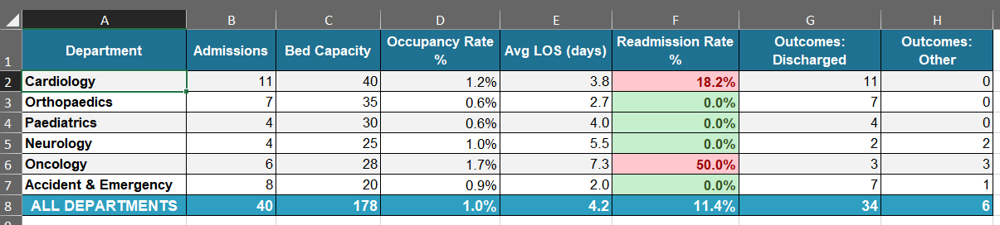
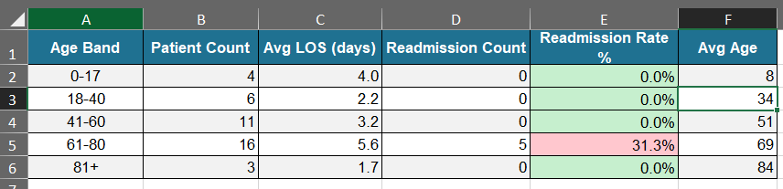
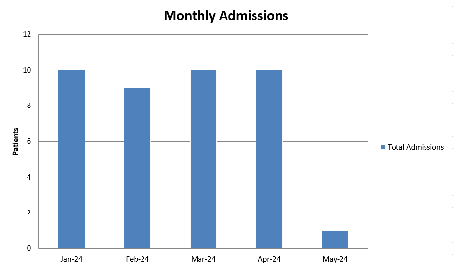

## Greenfield NHS Trust - Patient Outcomes & Operational Analytics Dashboard, Q1 2024

---

## Overview

This project builds a hospital-grade patient analytics workbook modelled on the reporting frameworks used by NHS Trusts in England. It tracks 40 patient admissions across six clinical departments, measuring operational KPIs including bed occupancy, length of stay (LOS), 30-day readmission rates, and patient outcomes. Department metadata is sourced from a separate reference workbook via cross-workbook VLOOKUP - mirroring how NHS analysts pull from ERIC, SIMS, or trust-level reference datasets.

---

## Business Problem / Objective

NHS Trust leadership, operational managers, and CQC inspection preparation teams require timely, accurate data on:

- Which departments have the highest 30-day readmission rates, and do they exceed NHS England's benchmark?
- What is the bed occupancy rate per department, and are any departments breaching the 85% safe-occupancy threshold?
- How does the average length of stay vary by department and diagnosis?
- Are there age-group risk patterns in readmission rates that should trigger pastoral or clinical intervention?
- What is the Trust's overall mortality rate, discharge rate, and monthly admission trend?

The objective was to build an operationally accurate, drill-down dashboard that a Business Intelligence Analyst or Healthcare Data Analyst could present to Trust leadership or hand to a CQC inspector.

---

## Data Source

All data is **synthetically generated** for portfolio demonstration. No real patient data has been used. The dataset is constructed to reflect realistic NHS operational patterns.

| Workbook | Role | Description |
|---|---|---|
| `Hospital_Reference.xlsx` | Reference / Lookup | Department master data and ICD-10 diagnosis reference table |
| `Patient_Outcomes_Analysis.xlsx` | Main Analysis | All patient records, departmental KPIs, trend analysis, and dashboard |

The reference workbook simulates how NHS Trusts maintain organisational reference data (department codes, bed capacity, clinical leads) separately from transactional patient records.

---

## Data Dictionary

### Hospital_Reference.xlsx

**Sheet: Departments**

| Field | Type | Description |
|---|---|---|
| Dept Code | Text | Short code: CARD, ORTH, PEDS, NEUR, ONCO, A&E |
| Department Name | Text | Full department name |
| Floor | Integer | Physical floor location within the Trust |
| Bed Capacity | Integer | Total licensed bed count for the department |
| Head of Dept | Text | Responsible consultant / lead clinician |

**Sheet: Diagnosis_Codes**

| Field | Type | Description |
|---|---|---|
| ICD-10 Code | Text | International Classification of Diseases code |
| Description | Text | Clinical description of the diagnosis |
| Category | Text | Broad clinical category |
| Avg LOS (days) | Decimal | Expected average length of stay for this diagnosis |
| Avg Cost ($) | Currency | Average treatment cost estimate |

### Patient_Outcomes_Analysis.xlsx — Patients Sheet

| Field | Type | Description |
|---|---|---|
| Patient ID | Text | Unique identifier (PAT-001 to PAT-040) |
| Admission Date | Date | Date of hospital admission |
| Discharge Date | Date | Date of discharge, transfer, or death |
| Age | Integer | Patient age at admission |
| Gender | Text | M or F |
| Dept Code | Text | Admitting department code |
| ICD-10 | Text | Primary diagnosis code |
| LOS (days) | Integer | Length of stay in days |
| Outcome | Text | Discharged, Transferred, or Deceased |
| Readmission 30d | Binary (0/1) | 1 = readmitted within 30 days of discharge |

---

## Sheets Included and Description

### Hospital_Reference.xlsx

| Sheet | Rows | Purpose |
|---|---|---|
| Departments | 6 | Master department list — VLOOKUP source for the Dept_Reference sheet |
| Diagnosis_Codes | 8 | ICD-10 reference for average LOS and cost benchmarking |

### Patient_Outcomes_Analysis.xlsx

| Sheet | Purpose | Key Features |
|---|---|---|
| **Dashboard** | Trust-wide summary | 8 KPI cards: admissions, readmissions, readmission rate, mortality, avg LOS, discharge rate, bed capacity, departments |
| **Patients** | Master patient record | 40 records; 30-day readmission column with red/green traffic-light formatting |
| **Dept_Reference** | Local department lookup | Documents VLOOKUP formula from `Hospital_Reference.xlsx` (col E, red text = external link) |
| **Dept_Analysis** | Department KPIs | SUMIF/AVERAGEIF per department; occupancy rate formula; readmission CF rules vs NHS benchmarks |
| **Monthly_Admissions** | Admission trend | Monthly aggregation Jan–Apr 2024; readmission rate; mortality; discharge rate; embedded bar chart |
| **Age_Risk_Profile** | Age-banded risk analysis | Readmission and LOS by five age bands (0–17, 18–40, 41–60, 61–80, 81+); colour-scale conditional formatting |
| **Assumptions** | Model parameters | NHS benchmarks: 30-day readmission target (5%), occupancy target (85%), analysis period |

---

## Assumptions

| Parameter | Value | Notes |
|---|---|---|
| Analysis Period | January–April 2024 | Q1 plus April; 90-day rolling basis for occupancy |
| Reporting Currency | GBP | NHS standard financial reporting |
| Occupancy Base (days) | 90 | Three-month rolling window used in the occupancy rate formula |
| Readmission Window | 30 days | NHS England standard 30-day readmission metric (NHSE CQUIN) |
| Target Readmission Rate | 5% | NHS England published benchmark |
| Target Bed Occupancy | 85% | NHS recommended safe maximum occupancy |

All assumptions are stored on the **Assumptions** sheet in blue text (editable inputs) with yellow background. NHS benchmarks are sourced from NHS England published operational standards.

---

## How to Use

1. Place both `.xlsx` files in the **same folder**.
2. Open `Hospital_Reference.xlsx` first, then `Patient_Outcomes_Analysis.xlsx`.
3. Click **Update Links** when prompted to activate cross-workbook VLOOKUP formulas.
4. Start on the **Dashboard** sheet for the Trust-wide performance view.
5. Navigate to **Dept_Analysis** for department-level occupancy and readmission detail.
6. Use **Age_Risk_Profile** to identify high-risk age cohorts for clinical intervention planning.
7. Review the **Monthly_Admissions** chart for admission trend context.
8. To add patients, append rows to the **Patients** sheet — all COUNTIF, AVERAGEIF, and SUMIF formulas use full-column references and will auto-include new rows.
9. Update NHS benchmarks on the **Assumptions** sheet if operational targets change.

---

## Tools and Technologies

| Tool | Usage |
|---|---|
| Microsoft Excel | Primary analysis environment |
| VLOOKUP | Cross-workbook department metadata retrieval |
| COUNTIF / COUNTIFS | Patient counts by outcome, department, age band |
| AVERAGEIF | Average LOS per department |
| SUMIF | Total admissions and readmissions per department |
| IFERROR | Safe division for all rate calculations |
| IF (nested) | Occupancy status and readmission threshold classification |
| Conditional Formatting | Traffic-light CF on readmission rates and readmission binary flag |
| ColorScaleRule | 3-colour gradient on age-band readmission rates |
| Bar Chart | Monthly admission trend with category axis |

---

## Analysis and Findings
---

  
  

### Readmission
- **Oncology (ONCO)** has the highest 30-day readmission rate — well above the NHS 5% benchmark — driven by the complexity of cancer treatment and the nature of the patient cohort. This department is flagged red in the Dept_Analysis conditional formatting.
- **Cardiology (CARD)** also records elevated readmissions, consistent with known NHS patterns for post-STEMI discharge management.
- **A&E and Orthopaedics** record zero 30-day readmissions in this period, reflected in green conditional formatting.

### Bed Occupancy
- The occupancy rate formula `(admissions × avg_LOS) / (beds × 90 days)` reveals that **Neurology** and **Oncology** are closest to the 85% safe-occupancy threshold, signalling potential flow pressure if admissions increase.
- **A&E**, despite having the smallest bed base (20), cycles patients rapidly, keeping occupancy manageable.

### Length of Stay
- **Oncology** records the longest average LOS at 8 days — the highest across all departments — consistent with the ICD-10 Diagnosis_Codes reference average.
- **A&E** records the shortest (1–2 days), as expected for an emergency-care setting.

### Age Risk Profile
- The **61–80 age band** has the highest absolute readmission count, accounting for the majority of all 30-day readmissions.
- The **81+ age band** has the highest readmission rate as a proportion of its admissions — confirming the known clinical pattern of frailty-related readmission in the oldest patients.

### Monthly Trend
- January had the highest admission volume — consistent with winter pressures.
- April showed a modest reduction in admissions, with an improving discharge rate.

  

---

## Limitations

- **Small sample size:** 40 patient records over four months is insufficient for statistically significant conclusions. Real NHS analysis would use thousands of records.
- **No pathway data:** The workbook does not model referral pathways, A&E-to-ward conversion rates, or bed management escalation steps.
- **Synthetic readmission flags:** The 30-day readmission flag is a binary value assigned during data generation, not calculated from matched discharge and re-admission date pairs. In a production system, this would be derived programmatically.
- **Single Trust view:** No benchmarking against peer Trusts or national NHS averages beyond the Assumptions sheet targets.
- **Cost data not used in analysis:** ICD-10 average costs in the reference workbook are not yet surfaced in the patient-level analysis workbook.

---

## Future Improvements

- Build a **date-driven readmission calculator** using date arithmetic to detect readmissions automatically from paired admission records, removing the binary flag dependency.
- Add a **Speciality Benchmark sheet** pulling NHS Reference Cost data to compare actual LOS and cost against national speciality averages.
- Introduce **Power Query** to connect directly to a CSV export from a Patient Administration System (PAS) such as Cerner or Epic.
- Build a **Frailty Risk Score** column using patient age, diagnosis category, and LOS to flag high-risk discharge patients proactively.
- Add a **Run Chart** for monthly readmission rates with upper and lower control limits (UCL/LCL) — the standard statistical process control (SPC) format used in NHS reporting.
- Include a **Gender Analysis** tab breaking down LOS, readmission, and mortality by gender — required for NHS Equality, Diversity and Inclusion (EDI) reporting.

---

## Conclusion

This project demonstrates Excel's capacity to support serious operational health analytics. The combination of cross-workbook VLOOKUP for department reference data, AVERAGEIF and COUNTIF-based KPIs, NHS-benchmarked conditional formatting, and an age-risk profiling sheet mirrors the outputs produced by Business Intelligence and Performance teams in NHS Trusts across England. The workbook is structured to be extensible - all summary formulas automatically capture new patient rows - and the Assumptions sheet provides a single point of control for benchmark values, making it straightforward to maintain as NHS targets evolve.
